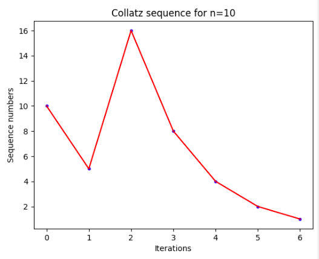

# Collatz Conjecture
### A study of the Collatz conjecture and the unusual behavior of the number 27 using Matplotlib in Python.

The Collatz conjecture, also known as the 3n+1 conjecture, is one of the most famous unsolved problems in mathematics:

"For any natural number n:

- If n is even, divide it by 2.
- If n is odd, multiply it by 3 and add 1.

- Repeat this process for the new number obtained.
- The conjecture states that, regardless of the initial number n, eventually you will reach the number 1 and enter a cycle of the form: 4, 2, 1, 4, 2, 1, ..."

The Collatz conjecture suggests that regardless of the starting number, eventually the number 1 will be reached by following the rules of the conjecture.

Although it has been extensively tested for very large numbers, the conjecture has not been proven or disproven for all natural numbers and remains an open problem in mathematics. [See article in Wikipedia.](https://en.wikipedia.org/wiki/Collatz_conjecture)

## 1) File collatz_sequence.py
In this file, we begin exploring the Collatz conjecture by generating sequences from a given number.
The number 10 is used as an example, but the user can modify it, even by entering an input.
When running the program, the following result is obtained:

[10, 5, 16, 8, 4, 2, 1]

## 2) File plot_collatz.py
In this second part, the Collatz sequence is used and the number of iterations is introduced into its definition for each case.
The sequence is then plotted against the number of iteration steps, with the initial number of the sequence assigned to step 0.

Three differents sequences are shown for N=10, N=100 and N=1000
 
 

## 3) File magical_numbers.py
Defining 'Collatz Magical Numbers' as the numbers that yield a maximum number of iterations, this part aims to find the series of numbers that generate local maxima in the number of iterations.

It is precisely here that attention is drawn to the number 27, which exhibits a gap and produces a high number of iterations (112) compared to its nearby neighbors.

## 4) File collatz_ratios.py
Finally, the ratio is calculated between the number of iterations and the "Collatz Magical Numbers" obtained with the find_largest function.
By graphing the ratio against the "Collatz Magical Numbers", it can be notably observed how the number 27 generates the highest ratio among all the numbers studied. Furthermore, the ratio follows a decreasing pattern as the initial number of the sequence increases, suggesting that there will be no other number that yields a higher ratio than that of the number 27.

## Conclusions
- A series of simple Python files were implemented to analyze and visualize the Collatz conjecture.
- The unusual gap generated by the number 27 in its number of iterations has drawn attention.
- It was analyzed (within a fairly acceptable range) that the number 27 produces a higher ratio (Number of Iterations/Initial Number) than any other number (112/27), with a repeating decimal value of 4.148148148148...
- All the obtained results do not constitute a formal study of the conjecture and were created with the purpose of applying the Matplotlib library to analyze the conjecture and contribute to its dissemination and popularization in our community.

Any suggestions are welcome, and you can send your comments to: fisicamaldonado.vaz@gmail.com.

# Biographical overview

The Collatz conjecture is named after the German mathematician Lothar Collatz, who formulated it in 1937. Collatz was born on July 6, 1910, in Arnsberg, Germany, and passed away on September 26, 1990, in Hamburg.

Collatz was a mathematician known for his work in number theory and mathematical analysis. Throughout his career, he made significant contributions in various fields, including the theory of functions, Diophantine equations, and ergodic theory.

The motivation behind Collatz's formulation of the conjecture is not clearly documented. It is believed that the conjecture emerged as a result of his fascination with patterns and recurrent behaviors in numerical sequences. Collatz may have been inspired by other similar mathematical problems involving sequences, such as the Syracuse problem.

Although Collatz published the conjecture in an internal report in 1937, the lack of significant progress in its proof or refutation led to its limited popularity until the 1970s when it was mentioned in mathematical publications and became a subject of study and curiosity.

Despite its apparent simplicity, the Collatz conjecture has proven to be extremely difficult to resolve. Numerous mathematicians have attempted to find a proof or counterexample, but to this day, the conjecture remains open and without a generally accepted solution.

Despite the lack of progress in his conjecture, Collatz left a lasting legacy in mathematics, and his conjecture continues to be a subject of fascination and study for mathematicians and enthusiasts worldwide.

## ---- Versión en español ----

# Conjetura de Collatz 
Un estudio de la conjetura de Collatz y el comportamiento inusual del número 27

La conjetura de Collatz, también conocida como la conjetura 3n+1, es uno de los problemas sin resolver más famosos en matemáticas:

"Para cualquier número natural n:

- Si n es par, divídalo por 2.
- Si n es impar, multiplíquelo por 3 y sume 1.

- Repita este proceso para el nuevo número obtenido.
- La conjetura establece que, independientemente del número inicial n, eventualmente se llegará al número 1 y se entrará en un ciclo de la forma: 4, 2, 1, 4, 2, 1, ..."

La conjetura de Collatz sugiere que sin importar el número de inicio, eventualmente se alcanzará el número 1 siguiendo las reglas de la conjetura.

Aunque se ha comprobado exhaustivamente para números muy grandes, la conjetura aún no ha sido demostrada o refutada para todos los números naturales y sigue siendo un problema abierto en la matemática. [Vea el artículo de Wikipedia](https://es.wikipedia.org/wiki/Conjetura_de_Collatz)

## 1) Archivo collatz_sequence.py

En este archivo, se comienza explorando la conjetura de Collatz a partir de las secuencias generadas a partir de un número dado.
Se ha dado como ejemplo el número 10, pero el usuario puede modificarlo, inclusive introduciendo un input.
Al correr el programa se obtiene el siguiente resultado:

[10, 5, 16, 8, 4, 2, 1]

## 2) Archivo plot_collatz.py

En esta segunda parte, se utiliza la secuencia de collatz y se introduce en su definición el número de iteraciones para cada caso.
Luego se grafica la secuencia en función del número de pasos de la iteración, asignando al paso 0 el número inicial de la secuencia.

Se muestran tres secuencias de Collatz para N=10, N=100 y N=1000.
 
 

## 3) Archivo magical_numbers.py

Definiendo a los 'Números mágicos de Collatz' como los números que arrojan un máximo en el número de iteraciones, se propone aquí encontrar la serie de números que arrojan máximos locales en la cantidad de iteraciones que generan.

Es aquí precisamente, cuando llama la atención para los primeros 100 números, cómo el número 27 genera un salto (gap) produciendo un número elevado de iteraciones (112) en comparación a sus vecinos cercanos.

## 4) Archivo collatz_ratios.py

Finalmente se realiza el ratio (cociente) entre el número de iteraciones y los "números mágicos de Collatz" obtenidos con la función find_largest.
Al graficar el ratio en función de los "números mágicos de Collatz" se puede observar notablmente cómo el número 27 genera un ratio máximo entre todos los números estudiados. Observando además cómo el ratio sigue un patrón decreciente a medida que aumenta el número inicial de la secuencia, se presume que no habrá otro número que arroje un ratio mayor que el del número 27.

## Conclusiones

- Se pudo realizar una serie de programas sencillos para analizar y visualizar la conjetura de Collatz.
- Ha llamado la atención el inusual gap que se genera en el número 27 en su cantidad de iteraciones.
- Se pudo analizar (en un rango bastante aceptable) que el número 27 genera un ratio (Cantidad de Iteraciones/Número inicial) más alto que cualquier otro (112/27), con un valor decimal periódico de 4.148148148148...
- Todos los resultados obtenidos, no constituyen un estudio formal de la conjetura y se han creado con la finalidad de aplicar la librería Matplotlib para analizar la conjetura y colaborar con su difusión y divulgación en nuestra comunidad.

Cualquier sugerencia es muy bienvenida y pueden hacerme llegar sus comentarios a fisicamaldonado.vaz@gmail.com

# Reseña Biográfica

La conjetura de Collatz lleva el nombre del matemático alemán Lothar Collatz, quien la formuló en 1937. Collatz nació el 6 de julio de 1910 en Arnsberg, Alemania, y falleció el 26 de septiembre de 1990 en Hamburgo.

Collatz era un matemático conocido por su trabajo en teoría de números y análisis matemático. Durante su carrera, realizó importantes contribuciones en varios campos, incluyendo la teoría de funciones, las ecuaciones diofánticas y la teoría ergódica.

La motivación de Collatz para formular su conjetura no está claramente documentada. Se cree que la conjetura surgió como resultado de su fascinación por los patrones y comportamientos recurrentes en las secuencias numéricas. Collatz pudo haberse inspirado en otros problemas matemáticos similares que involucran secuencias, como el problema de Syracuse.

Aunque Collatz publicó la conjetura en un informe interno en 1937, la falta de avances significativos en su demostración o refutación llevó a que la conjetura no se popularizara ampliamente hasta la década de 1970, cuando fue mencionada en publicaciones matemáticas y se convirtió en objeto de estudio y curiosidad.

A pesar de su aparente simplicidad, la conjetura de Collatz ha demostrado ser extremadamente difícil de resolver. Numerosos matemáticos han intentado encontrar una demostración o contraejemplo, pero hasta la fecha, la conjetura permanece abierta y sin una solución generalmente aceptada.

A pesar de la falta de avances en su conjetura, Collatz dejó un legado duradero en las matemáticas y su conjetura sigue siendo objeto de fascinación y estudio por parte de matemáticos y entusiastas de todo el mundo.
